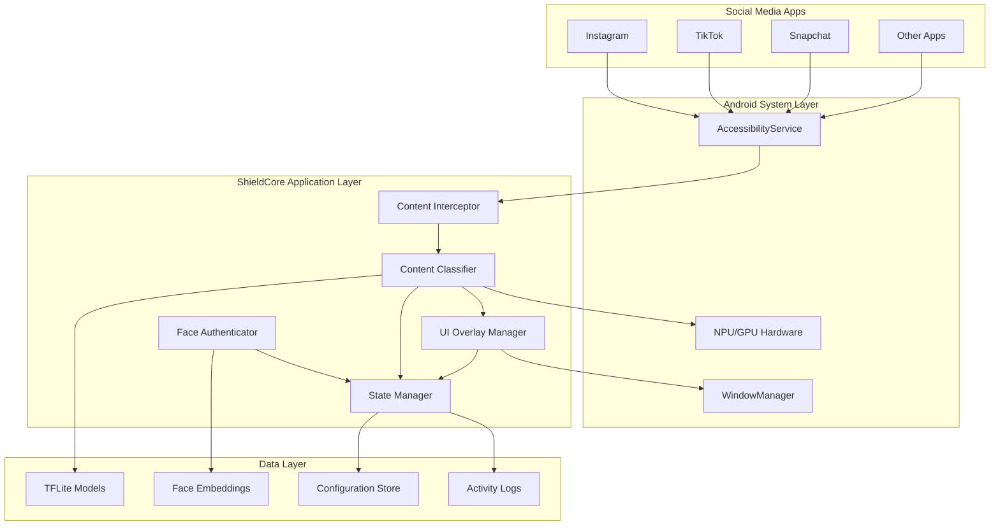
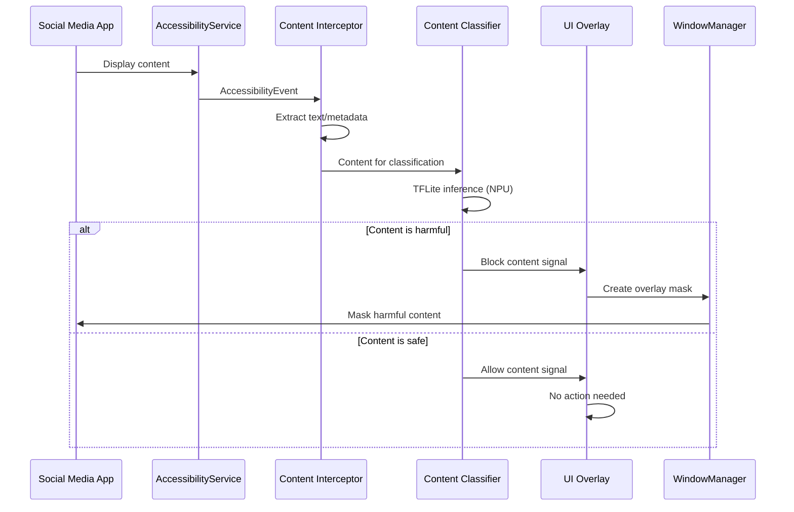

# Design Document: ShieldCore

## Overview

ShieldCore is a system-level content moderation architecture that operates at the Android OS interface layer to provide real-time content filtering for social media applications. The system leverages Android's AccessibilityService API to intercept content, processes it through on-device TensorFlow Lite models for classification, and applies dynamic UI masking to protect minors from harmful content while preserving their social media experience.

The architecture follows a local-first approach, ensuring all AI inference, biometric authentication, and content analysis occurs entirely on-device without external data transmission. This design prioritizes privacy, minimizes latency, and maintains functionality even without network connectivity.

## Architecture

### High-Level Architecture



### Component Interaction Flow



## Components and Interfaces

### Content Interceptor

**Purpose**: Captures real-time content from social media applications using Android's AccessibilityService API.

**Key Responsibilities**:
- Monitor AccessibilityEvents from target applications
- Extract visible text content and metadata
- Handle rapid scrolling and dynamic content updates
- Maintain capture accuracy above 95% during normal usage

**Interface**:
```kotlin
interface ContentInterceptor {
    fun startMonitoring(targetPackages: List<String>)
    fun stopMonitoring()
    fun onAccessibilityEvent(event: AccessibilityEvent): ContentData?
    fun registerContentListener(listener: ContentListener)
}

data class ContentData(
    val text: String,
    val metadata: ContentMetadata,
    val timestamp: Long,
    val sourceApp: String,
    val screenBounds: Rect
)
```

**Implementation Details**:
- Extends AccessibilityService with TYPE_VIEW_TEXT_CHANGED and TYPE_WINDOW_CONTENT_CHANGED event types
- Uses AccessibilityNodeInfo traversal to extract text from UI elements
- Implements debouncing to handle rapid scroll events
- Caches recent content to avoid duplicate processing

### Content Classifier

**Purpose**: Analyzes intercepted content using on-device TensorFlow Lite models to determine safety classification.

**Key Responsibilities**:
- Load and manage TFLite models for text and image classification
- Perform inference using NPU/GPU acceleration when available
- Classify content into categories: safe, hate speech, violence, adult content
- Maintain classification accuracy above 90% for text, 85% for images

**Interface**:
```kotlin
interface ContentClassifier {
    fun classifyText(text: String): ClassificationResult
    fun classifyImage(bitmap: Bitmap): ClassificationResult
    fun updateModels(modelPaths: List<String>)
    fun getModelVersion(): String
}

data class ClassificationResult(
    val category: ContentCategory,
    val confidence: Float,
    val processingTimeMs: Long
)

enum class ContentCategory {
    SAFE, HATE_SPEECH, GRAPHIC_VIOLENCE, ADULT_CONTENT, UNKNOWN
}
```

**Implementation Details**:
- Uses TensorFlow Lite Interpreter with NNAPI delegate for NPU acceleration
- Implements model ensemble for improved accuracy
- Supports dynamic model loading and hot-swapping
- Includes preprocessing pipelines for text tokenization and image normalization

### UI Overlay Manager

**Purpose**: Creates and manages visual overlays to mask harmful content while preserving app layout and functionality.

**Key Responsibilities**:
- Create WindowManager overlays with TYPE_APPLICATION_OVERLAY
- Position overlays precisely over harmful content regions
- Maintain overlay synchronization during scrolling and app transitions
- Consume less than 5% additional CPU resources

**Interface**:
```kotlin
interface UIOverlayManager {
    fun createOverlay(bounds: Rect, content: ContentData)
    fun removeOverlay(overlayId: String)
    fun updateOverlayPosition(overlayId: String, newBounds: Rect)
    fun clearAllOverlays()
}

data class OverlayConfig(
    val maskType: MaskType,
    val opacity: Float,
    val blurRadius: Float,
    val replacementText: String?
)
```

**Implementation Details**:
- Uses WindowManager.LayoutParams with FLAG_NOT_TOUCHABLE for non-interactive overlays
- Implements smooth animations for overlay appearance/disappearance
- Supports multiple masking strategies: blur, solid color, replacement text
- Handles multi-window and split-screen scenarios

### Face Authenticator

**Purpose**: Provides secure biometric authentication for parental privilege escalation using on-device facial recognition.

**Key Responsibilities**:
- Enroll and store parent face embeddings locally
- Perform real-time face verification using Google ML Kit
- Manage authentication state and timeout policies
- Ensure biometric data never leaves the device

**Interface**:
```kotlin
interface FaceAuthenticator {
    fun enrollParentFace(bitmap: Bitmap): EnrollmentResult
    fun authenticateParent(bitmap: Bitmap): AuthenticationResult
    fun removeParentFace(faceId: String)
    fun isAuthenticationEnabled(): Boolean
}

data class AuthenticationResult(
    val success: Boolean,
    val confidence: Float,
    val faceId: String?,
    val errorMessage: String?
)
```

**Implementation Details**:
- Uses Google ML Kit Face Detection API with high accuracy mode
- Implements MobileFaceNet-style embedding extraction
- Stores encrypted face embeddings in Android Keystore
- Includes liveness detection to prevent photo-based attacks

### State Manager

**Purpose**: Coordinates system state transitions between Guardian Mode and Privilege Mode, manages configuration, and handles persistence.

**Key Responsibilities**:
- Manage Guardian/Privilege mode transitions
- Persist configuration and activity logs
- Handle system lifecycle events (boot, app updates)
- Coordinate between all system components

**Interface**:
```kotlin
interface StateManager {
    fun setMode(mode: SystemMode)
    fun getCurrentMode(): SystemMode
    fun saveConfiguration(config: ShieldCoreConfig)
    fun loadConfiguration(): ShieldCoreConfig
    fun logActivity(activity: ActivityLog)
}

enum class SystemMode {
    GUARDIAN_MODE, PRIVILEGE_MODE, DISABLED
}
```

## Data Models

### Core Data Structures

```kotlin
data class ShieldCoreConfig(
    val enabledCategories: Set<ContentCategory>,
    val sensitivityLevels: Map<ContentCategory, Float>,
    val parentFaceIds: List<String>,
    val privilegeTimeoutMinutes: Int,
    val targetApplications: List<String>,
    val overlayConfig: OverlayConfig
)

data class ActivityLog(
    val timestamp: Long,
    val event: ActivityEvent,
    val contentCategory: ContentCategory?,
    val sourceApp: String,
    val actionTaken: String
)

enum class ActivityEvent {
    CONTENT_BLOCKED, CONTENT_ALLOWED, PRIVILEGE_GRANTED, 
    PRIVILEGE_DENIED, MODE_CHANGED, SYSTEM_ERROR
}

data class ContentMetadata(
    val author: String?,
    val timestamp: Long?,
    val mediaType: MediaType,
    val interactionCount: Int?,
    val hashtags: List<String>
)

enum class MediaType {
    TEXT_ONLY, IMAGE, VIDEO, MIXED_CONTENT
}
```

### Model Management

```kotlin
data class ModelInfo(
    val modelId: String,
    val version: String,
    val category: ContentCategory,
    val accuracy: Float,
    val filePath: String,
    val checksum: String
)

data class ModelUpdateRequest(
    val modelId: String,
    val downloadUrl: String,
    val expectedChecksum: String,
    val priority: UpdatePriority
)
```

## Error Handling

### Error Categories and Recovery Strategies

**Critical Errors** (System Safety Compromised):
- AccessibilityService permission revoked → Immediate notification + permission request
- TFLite model corruption → Fallback to conservative blocking + model re-download
- WindowManager overlay failure → Disable app access until overlay restored

**Performance Errors** (Degraded Experience):
- NPU unavailable → Fallback to CPU inference with reduced throughput
- Memory pressure → Reduce model complexity + increase garbage collection
- Battery optimization interference → Request whitelist + adjust processing frequency

**Authentication Errors** (Privilege Escalation Issues):
- Face detection failure → Retry with improved lighting guidance
- Multiple failed attempts → Temporary lockout with exponential backoff
- Biometric hardware unavailable → Fallback to PIN-based authentication

### Error Recovery Implementation

```kotlin
class ErrorRecoveryManager {
    fun handleCriticalError(error: CriticalError) {
        when (error.type) {
            ErrorType.ACCESSIBILITY_PERMISSION_LOST -> {
                notifyParent("Critical: Accessibility permission required")
                requestPermissionRestoration()
                enterSafeMode() // Block all apps until restored
            }
            ErrorType.MODEL_CORRUPTION -> {
                loadBackupModel()
                scheduleModelRedownload()
                logIncident(error)
            }
            ErrorType.OVERLAY_SYSTEM_FAILURE -> {
                disableTargetApps()
                restartOverlayService()
                notifyParent("UI protection temporarily disabled")
            }
        }
    }
}
```

## Testing Strategy

### Dual Testing Approach

ShieldCore requires both unit testing and property-based testing to ensure comprehensive coverage:

**Unit Tests**: Focus on specific examples, edge cases, and integration points between components. These tests validate concrete scenarios like specific harmful content detection, overlay positioning accuracy, and authentication flows.

**Property-Based Tests**: Verify universal properties that must hold across all inputs. These tests use randomized input generation to validate system behavior across the full input space, ensuring robustness against unexpected content variations.

### Property-Based Testing Configuration

- **Testing Framework**: Use Kotest Property Testing for Kotlin
- **Minimum Iterations**: 100 iterations per property test
- **Test Tagging**: Each property test must reference its design document property
- **Tag Format**: `@Tag("Feature: shield-core, Property {number}: {property_text}")`

### Testing Infrastructure

**Test Data Generation**:
- Content generators for various social media post formats
- Biometric data simulators for face authentication testing
- UI event simulators for accessibility service testing
- Performance load generators for resource constraint testing

**Test Environment Setup**:
- Android emulator with accessibility services enabled
- Mock social media apps with controlled content
- Simulated NPU/GPU environments for hardware acceleration testing
- Network isolation for local-first validation

## Correctness Properties

*A property is a characteristic or behavior that should hold true across all valid executions of a system—essentially, a formal statement about what the system should do. Properties serve as the bridge between human-readable specifications and machine-verifiable correctness guarantees.*

Based on the prework analysis, the following properties have been identified as testable and consolidated to eliminate redundancy:

### Performance Properties

**Property 1: Content Interception Timing**
*For any* social media content that appears on screen, the Content_Interceptor should capture the text and metadata within 100ms
**Validates: Requirements 1.1**

**Property 2: Content Classification Timing**
*For any* intercepted content, the Content_Classifier should categorize it within 200ms using local TFLite_Models
**Validates: Requirements 2.1**

**Property 3: UI Overlay Response Timing**
*For any* content classified as harmful, the UI_Overlay should mask it with a visual overlay within 50ms
**Validates: Requirements 3.1**

**Property 4: Resource Consumption Limits**
*For any* normal operation period, ShieldCore should consume less than 10% of total CPU resources
**Validates: Requirements 6.1**

**Property 5: Battery Efficiency**
*For any* continuous processing period, ShieldCore should maintain battery drain below 5% per hour
**Validates: Requirements 6.2**

### Content Processing Properties

**Property 6: Content Capture Accuracy Under Load**
*For any* rapid scrolling scenario, the Content_Interceptor should maintain capture accuracy above 95%
**Validates: Requirements 1.4**

**Property 7: Text Classification Accuracy**
*For any* text content analyzed, the Content_Classifier should detect hate speech, graphic violence, and adult content with 90% accuracy
**Validates: Requirements 2.2**

**Property 8: Image Classification Accuracy**
*For any* image content processed, the Content_Classifier should identify inappropriate visual material with 85% accuracy
**Validates: Requirements 2.3**

**Property 9: Low Confidence Default Blocking**
*For any* content with classification confidence below 70%, the Content_Classifier should default to blocking the content
**Validates: Requirements 2.4**

**Property 10: Concurrent Content Monitoring**
*For any* set of simultaneously running social media apps, the Content_Interceptor should monitor all visible content streams concurrently
**Validates: Requirements 1.3**

**Property 11: Parallel Content Processing**
*For any* mixed content types present simultaneously, the Content_Classifier should process all types in parallel
**Validates: Requirements 2.6**

### UI Overlay Properties

**Property 12: Safe Content Display**
*For any* content classified as safe, the UI_Overlay should allow it to display normally without creating overlays
**Validates: Requirements 3.2**

**Property 13: Layout Preservation**
*For any* content being masked, the UI_Overlay should preserve the original layout and scrolling behavior
**Validates: Requirements 3.3**

**Property 14: Interaction Blocking**
*For any* user interaction attempt with masked content, the UI_Overlay should prevent the interaction
**Validates: Requirements 3.4**

**Property 15: Cross-App Consistency**
*For any* app transition, the UI_Overlay should maintain consistent masking behavior across different applications
**Validates: Requirements 3.5**

### Authentication and Security Properties

**Property 16: Biometric Authentication Flow**
*For any* parent privilege escalation attempt, the Face_Authenticator should verify identity using local facial recognition and switch to Privilege_Mode upon success
**Validates: Requirements 4.1, 4.2**

**Property 17: Authentication Lockout**
*For any* sequence of 3 failed facial recognition attempts, the Face_Authenticator should lock privilege escalation for 30 minutes
**Validates: Requirements 4.3**

**Property 18: Automatic Mode Timeout**
*For any* Privilege_Mode session, ShieldCore should automatically return to Guardian_Mode after 60 minutes of inactivity
**Validates: Requirements 4.4**

**Property 19: Selective Face Authentication**
*For any* scenario with multiple detected faces, the Face_Authenticator should only authenticate registered parent faces
**Validates: Requirements 4.6**

### Privacy and Local-First Properties

**Property 20: Local-First Processing**
*For any* content analysis, AI inference, or biometric authentication operation, ShieldCore should perform all processing locally without external network requests
**Validates: Requirements 5.1, 5.3, 5.4**

**Property 21: Local Data Storage**
*For any* face embedding data or TFLite models, ShieldCore should store them locally and never transmit them externally
**Validates: Requirements 4.5, 5.2**

**Property 22: Offline Operation**
*For any* period when network connectivity is unavailable, ShieldCore should continue operating with full functionality
**Validates: Requirements 5.6**

**Property 23: Anonymous Telemetry**
*For any* system telemetry collected, ShieldCore should only store anonymous usage statistics locally
**Validates: Requirements 5.5**

### System Integration Properties

**Property 24: Platform Compatibility**
*For any* Android device running version 8.0 or higher, ShieldCore should function with full feature compatibility
**Validates: Requirements 7.1**

**Property 25: Automatic App Discovery**
*For any* newly installed social media app, the Accessibility_Service should automatically extend monitoring coverage
**Validates: Requirements 7.2**

**Property 26: Service Coexistence**
*For any* scenario with other accessibility services running, ShieldCore should coexist without conflicts
**Validates: Requirements 7.5**

**Property 27: State Persistence**
*For any* device restart, ShieldCore should automatically resume Guardian_Mode if it was previously active
**Validates: Requirements 7.6**

### Configuration and Management Properties

**Property 28: Granular Configuration**
*For any* content category, ShieldCore should provide independent configuration controls
**Validates: Requirements 8.1**

**Property 29: Privacy-Preserving Logging**
*For any* activity log review, ShieldCore should display blocked content statistics without revealing actual content
**Validates: Requirements 8.2**

**Property 30: Real-Time Configuration Updates**
*For any* sensitivity setting adjustment, the Content_Classifier should update filtering thresholds immediately
**Validates: Requirements 8.3**

**Property 31: Profile Isolation**
*For any* child profile created, ShieldCore should maintain separate filtering policies per profile
**Validates: Requirements 8.6**

### Model Management Properties

**Property 32: Secure Model Updates**
*For any* new model version available, ShieldCore should download and validate it securely using cryptographic signatures
**Validates: Requirements 9.1, 9.5**

**Property 33: Seamless Model Transitions**
*For any* model update applied, the Content_Classifier should continue classification without service interruption
**Validates: Requirements 9.2**

**Property 34: Automatic Model Rollback**
*For any* model performance degradation detected, ShieldCore should automatically rollback to the previous stable version
**Validates: Requirements 9.3**

### Error Handling and Resilience Properties

**Property 35: Fail-Safe Content Blocking**
*For any* Content_Classifier failure, ShieldCore should default to blocking all unclassified content
**Validates: Requirements 10.1**

**Property 36: Service Recovery**
*For any* UI_Overlay crash, ShieldCore should restart the overlay service within 5 seconds
**Validates: Requirements 10.2**

**Property 37: Resource Prioritization**
*For any* system resource exhaustion, ShieldCore should prioritize core safety functions over optional features
**Validates: Requirements 10.4**

**Property 38: Privacy-Preserving Error Logging**
*For any* critical error occurrence, ShieldCore should log diagnostic information for troubleshooting while maintaining privacy
**Validates: Requirements 10.6**

### Hardware Acceleration Properties

**Property 39: NPU Utilization**
*For any* device with available NPU, the Content_Classifier should utilize hardware acceleration for inference
**Validates: Requirements 2.5**

**Property 40: Power-Aware Processing**
*For any* device charging state, ShieldCore should utilize additional processing power for model optimization
**Validates: Requirements 6.6**

## Testing Strategy

### Dual Testing Approach

ShieldCore requires both unit testing and property-based testing to ensure comprehensive coverage and system reliability:

**Unit Tests**: Focus on specific examples, edge cases, and integration points between components. These tests validate concrete scenarios such as:
- Specific harmful content detection examples
- Overlay positioning accuracy for known UI layouts  
- Authentication flows with known biometric data
- Error handling for specific failure modes
- Integration between AccessibilityService and content interception

**Property-Based Tests**: Verify universal properties that must hold across all inputs using randomized test data generation. These tests ensure robustness against unexpected content variations and validate system behavior across the full input space.

### Property-Based Testing Configuration

**Testing Framework**: Kotest Property Testing for Kotlin
- Minimum 100 iterations per property test (due to randomization and ML model variability)
- Each property test must reference its design document property
- Tag format: `@Tag("Feature: shield-core, Property {number}: {property_text}")`
- Custom generators for social media content, UI events, and biometric data

**Test Data Generators**:
```kotlin
// Content generators for various social media formats
object ContentGenerators {
    fun socialMediaPost(): Arb<ContentData>
    fun harmfulTextContent(): Arb<String>
    fun safeTextContent(): Arb<String>
    fun mixedMediaContent(): Arb<ContentData>
    fun rapidScrollingSequence(): Arb<List<ContentData>>
}

// UI event generators for accessibility testing
object UIEventGenerators {
    fun accessibilityEvent(): Arb<AccessibilityEvent>
    fun multiAppScenario(): Arb<List<String>>
    fun overlayBounds(): Arb<Rect>
}

// Biometric data generators for authentication testing
object BiometricGenerators {
    fun faceEmbedding(): Arb<FloatArray>
    fun parentFaceData(): Arb<Bitmap>
    fun multiplefaces(): Arb<List<Bitmap>>
}
```

### Testing Infrastructure Requirements

**Android Test Environment**:
- Android emulator with API level 26+ (Android 8.0+)
- Accessibility services enabled and configured
- Mock social media applications with controlled content
- Simulated NPU/GPU environments for hardware acceleration testing
- Network isolation capabilities for local-first validation

**Performance Testing Setup**:
- CPU and memory monitoring tools
- Battery usage measurement frameworks
- Thermal simulation for overheating scenarios
- Load testing with concurrent content streams

**Security Testing Environment**:
- Network traffic monitoring for privacy validation
- Encrypted storage verification tools
- Biometric spoofing detection testing
- Permission management testing frameworks

### Unit Testing Focus Areas

**Component Integration Tests**:
- AccessibilityService → Content Interceptor integration
- Content Classifier → UI Overlay coordination
- Face Authenticator → State Manager communication
- Model Manager → Content Classifier updates

**Edge Case Validation**:
- Empty or malformed content handling
- Rapid app switching scenarios
- Low memory and storage conditions
- Network connectivity loss during operations
- Accessibility permission revocation

**Error Recovery Testing**:
- Service crash and restart scenarios
- Model corruption and fallback behavior
- Authentication hardware failures
- Resource exhaustion handling

### Property Test Implementation Examples

```kotlin
class ContentInterceptionProperties : StringSpec({
    
    "Property 1: Content Interception Timing" {
        checkAll(ContentGenerators.socialMediaPost()) { content ->
            val startTime = System.currentTimeMillis()
            val result = contentInterceptor.capture(content)
            val endTime = System.currentTimeMillis()
            
            result.shouldNotBeNull()
            (endTime - startTime).shouldBeLessThan(100)
        }
    }.config(tag = Tag("Feature: shield-core, Property 1: Content Interception Timing"))
    
    "Property 7: Text Classification Accuracy" {
        checkAll(ContentGenerators.labeledTextContent()) { (text, expectedCategory) ->
            val result = contentClassifier.classifyText(text)
            
            // Accuracy measured across all test iterations
            result.category.shouldBe(expectedCategory)
            result.confidence.shouldBeGreaterThan(0.7f)
        }
    }.config(
        tag = Tag("Feature: shield-core, Property 7: Text Classification Accuracy"),
        iterations = 1000 // Higher iterations for accuracy measurement
    )
})
```

This comprehensive testing strategy ensures that ShieldCore maintains high reliability, performance, and security standards while protecting user privacy and providing effective content moderation capabilities.